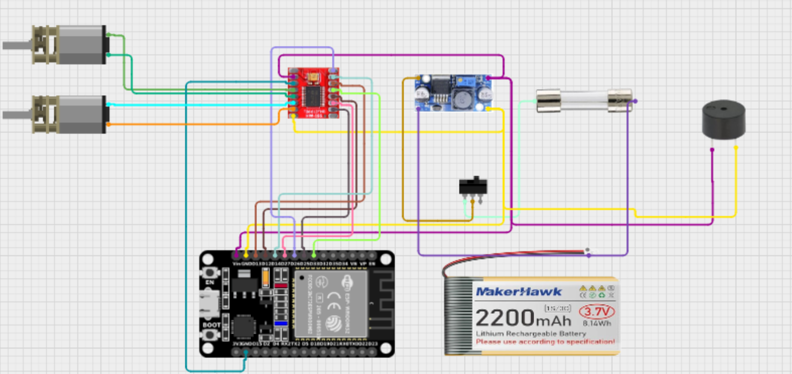

# Diretório de Eletrônica

Este diretório deve conter todos os arquivos relacionados ao projeto eletrônico do robô *(categoria do robô)*, incluindo:

- Esquemáticos eletrônicos
- Layout de PCB
- Lista de componentes (BOM)
  * planilha de componentes eletronicos (https://docs.google.com/spreadsheets/d/1agG4XEwVY7tFlbT6GtZfWE7ugiVqS48p61Cghws9TIE/edit?usp=sharing)
  * Buzzer ativo 5V
  * Fusível
  * 2 motores N20
  * Placa Universal
  * Ponte H Dupla com Driver TB6612FNG
  * Bateria 7,4V 2200 mAh
  * Esp32 Devkit V1
  * Regulador De Tensão Step Down
  * 2 Rodas de Silicone
  * Switch
  
- Datasheets dos componentes
- Diagramas de conexão
 
- Link para o diagram no Cirkit Designer IDE (https://app.cirkitdesigner.com/project/51768e7f-3658-4a64-9f8b-6be969e59565) 
- Configurações de hardware

## Estrutura

- `img/`: Pasta contendo imagens do projeto eletrônico
  - Fotos das placas
  - Esquemas de conexão
  - Diagramas de pinout

## Documentação

Neste README deve conter as instruções de uso, pinos utilizados e explicação do circuito.
