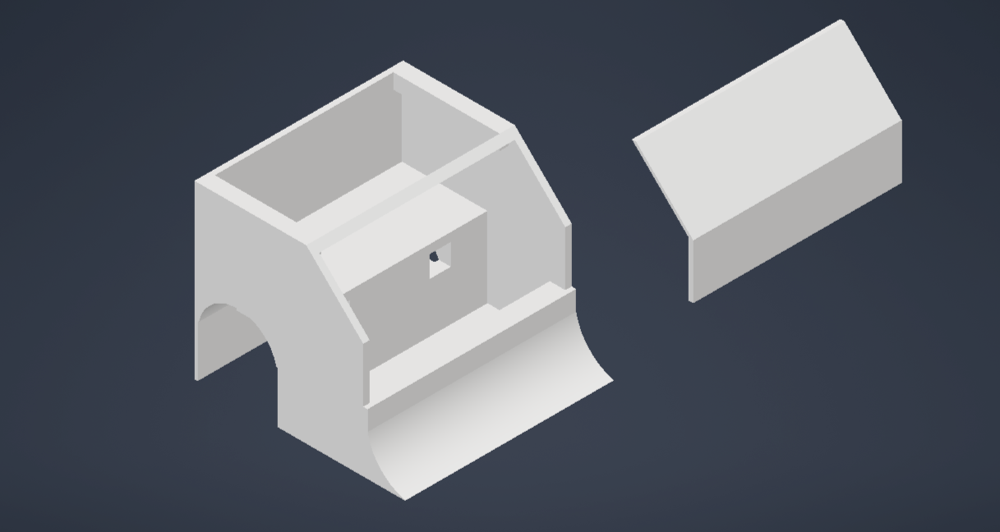

# Diretório de Mecânica

Este diretório deve conter todos os arquivos relacionados ao projeto mecânico do robô *(categoria do robô)*, incluindo:

- Arquivos CAD 3D
- Desenhos técnicos
  * Desenhos técnicos 
- Arquivos para impressão 3D
- Listas de materiais:
  *(BOM)

| Item | Descrição                         | Quantidade | Observações                    |
|------|----------------------------------|------------|--------------------------------|
| 1    | Parafuso                          | 9          | --                             |
| 2    | Rolamento                         | 2          | Utilizados como pesos          |
| 3    | Suporte de motor N20              | 2          | —                              |

- Guias de montagem mecânica
- Especificações de peças

## Estrutura

-`img/`: Imagens do Chassi
- `3d_model/`: Modelos 3D das peças com versões
- `drawing/`: Desenhos técnicos e vistas
- `assembly/`: Instruções de montagem
- `stl_file/`: Arquivos prontos para impressão 3D

## Boas Práticas

1. Mantenha versões dos arquivos CAD organizadas em pastas
2. Documente todas as dimensões críticas
3. Inclua instruções de impressão 3D
4. Mantenha lista de materiais atualizada
5. Documente modificações e melhorias

## Documentação

Neste README deve conter as modelagens feitas, melhorias e modificações de cada versão.
